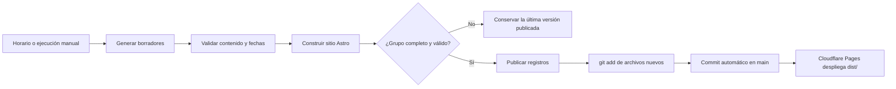

# Ranking Zodiacal

Sitio web estático de entretenimiento dedicado al horóscopo semanal. El proyecto combina un ranking editorial de los 12 signos con lecturas individuales, pronósticos por periodo y una experiencia responsive pensada para consultar el contenido desde cualquier dispositivo.

**Demo:** [horoscopo-semanal.pages.dev](https://horoscopo-semanal.pages.dev/)

[](https://github.com/jhony-abz/horoscopo-semanal/actions/workflows/publish-daily.yml)
[](https://github.com/jhony-abz/horoscopo-semanal/actions/workflows/publish-weekly.yml)
[](https://github.com/jhony-abz/horoscopo-semanal/actions/workflows/validate.yml)

## Sobre el proyecto

Ranking Zodiacal nace como un proyecto de portafolio para explorar una experiencia editorial moderna alrededor del horóscopo. La portada presenta la edición semanal vigente y cada signo cuenta con una página propia, una identidad cromática individual y contenido organizado en cuatro periodos:

- Hoy
- Mañana
- Esta semana
- Este mes

El contenido se publica como archivos Markdown versionados en GitHub. Esto permite mantener un sitio rápido, sin base de datos y con un flujo editorial sencillo mediante Pages CMS.

## Funcionalidades

- Ranking semanal del puesto 1 al 12.
- Página SEO independiente para cada signo.
- Paleta base verde con identidad visual propia para cada signo.
- Pronósticos organizados por día, semana y mes.
- Indicadores editoriales de suerte general, amorosa, profesional, económica y bienestar.
- Selector de signo mediante un diálogo accesible.
- Persistencia del signo preferido usando `localStorage`.
- Compartir contenido mediante Web Share API y copia de enlace.
- Diseño responsive para móvil, tablet y escritorio.
- Navegación por teclado, estados de foco visibles y soporte para movimiento reducido.
- Sitemap, `robots.txt`, URLs semánticas y metadatos preparados para SEO.
- Validación de contenido durante el build para evitar ediciones incompletas.

> El contenido es de entretenimiento y no reemplaza asesoría médica, legal, financiera o profesional.

## Tecnologías

| Tecnología | Uso |
| --- | --- |
| [Astro](https://astro.build/) | Generación de páginas estáticas y componentes |
| TypeScript | Tipado y validación del código |
| Markdown | Gestión del contenido editorial |
| Astro Content Collections | Esquemas y validación de semanas y pronósticos |
| CSS | Sistema visual responsive y temas por signo |
| Playwright | Pruebas end-to-end |
| Pages CMS | Edición del contenido desde GitHub |
| Cloudflare Pages | Hosting, despliegues y previews |
| Cloudflare Web Analytics | Métricas orientadas a privacidad |

## Estructura del proyecto

```text
src/
├── components/             # Componentes visuales reutilizables
├── content/
│   ├── forecasts/           # Pronósticos de hoy, mañana y mes
│   ├── horoscopes/          # Lecturas semanales por signo
│   └── weeks/               # Ediciones semanales
├── layouts/                # Layout global del sitio
├── lib/                    # Consultas y reglas de contenido
├── pages/                  # Rutas públicas de Astro
├── styles/                 # Estilos globales y tokens visuales
└── data-signs.ts           # Datos y temas de los 12 signos

scripts/                    # Automatizaciones editoriales
tests/                      # Pruebas end-to-end
.pages.yml                  # Configuración de Pages CMS
```

## Desarrollo local

Requisitos:

- Node.js `22.12.0` o superior.
- npm.

Instala las dependencias y levanta el entorno de desarrollo:

```bash
npm install
npm run dev
```

Comandos de validación:

```bash
# Comprobar tipos y contenido
npm run check

# Generar la versión de producción
npm run build

# Ejecutar la suite completa
npm run test

# Ejecutar solo las pruebas end-to-end
npm run test:e2e
```

## Gestión del contenido

El contenido editorial se organiza en tres colecciones:

- `src/content/weeks/`: edición semanal, fechas, título, tema e introducción.
- `src/content/horoscopes/`: ranking, resumen, métricas y lectura completa de cada signo.
- `src/content/forecasts/`: pronósticos para hoy, mañana y este mes.

Los registros pueden estar en estado `draft` o `published`. Los borradores no se muestran en la web pública. Las validaciones comprueban fechas, puntuaciones de 1 a 5 y la integridad de los 12 signos antes de generar el sitio.

La edición manual se realiza con [Pages CMS](https://pagescms.org/) mediante la configuración de [`.pages.yml`](.pages.yml). Cada cambio aprobado genera un commit en GitHub y puede activar un nuevo despliegue.

## Automatización editorial

Los workflows de GitHub Actions preparan y publican contenido de forma programada. Las horas están expresadas en `America/Lima`; GitHub ejecuta los cron en UTC.

| Workflow | Programación | Contenido |
| --- | --- | --- |
| `publish-daily.yml` | Todos los días, 5:00 a. m. | Hoy y mañana para los 12 signos |
| `publish-weekly.yml` | Lunes, 5:00 a. m. | Ranking y lectura semanal |
| `publish-monthly.yml` | Día 1 de cada mes, 5:00 a. m. | Pronósticos mensuales |
| `validate.yml` | Cada push y pull request | Type check, build y pruebas E2E |

El workflow diario también se inicia cuando cambia `main`, para que una corrección pueda recuperar una publicación pendiente. Los workflows semanal y mensual se pueden ejecutar manualmente desde **GitHub → Actions → Run workflow**.

### Flujo de publicación



Cada workflow editorial valida antes y después de publicar. Si falla una validación, no hace commit y la web mantiene la última edición válida. La comprobación de cambios se realiza después de `git add`, por lo que también detecta archivos Markdown nuevos.

Las pruebas de navegador están separadas en `validate.yml`. Los workflows editoriales ejecutan `npm run check` y `npm run build`, pero no instalan Chromium ni repiten Playwright; así una incidencia de infraestructura de pruebas no bloquea la actualización del contenido.

Los workflows principales son:

- `publish-daily.yml`: procesa los pronósticos de hoy y mañana.
- `publish-weekly.yml`: prepara la nueva edición semanal.
- `publish-monthly.yml`: prepara el contenido del nuevo mes.
- `validate.yml`: ejecuta las comprobaciones del proyecto y las pruebas E2E con Chromium.

Si una generación falla, se conserva la última versión válida y el detalle queda registrado en la ejecución correspondiente de GitHub Actions.

## Despliegue

El sitio se despliega en Cloudflare Pages desde la rama `main`.

Configuración utilizada:

```text
Build command: npm run build
Output directory: dist
Production branch: main
Node.js: 22.12.0
```

Cada push a `main` genera un nuevo despliegue de producción. Los pull requests pueden utilizar despliegues de preview para revisar los cambios antes de publicarlos.

### Publicación manual de emergencia

Para recuperar una edición sin esperar al próximo horario:

1. Abre la pestaña **Actions** del repositorio.
2. Selecciona `Publish daily zodiac ranking`, `Publish weekly zodiac ranking` o `Publish monthly zodiac forecasts`.
3. Pulsa **Run workflow** y confirma la rama `main`.
4. Espera a que termine en estado `success`.
5. Revisa el commit automático y el nuevo despliegue de Cloudflare Pages.

No es necesario editar archivos generados manualmente: el workflow crea el contenido, valida el grupo completo y lo versiona en GitHub.

## Próximas mejoras

- Historial navegable de ediciones anteriores.
- Más opciones para compartir cada lectura.
- Mejoras de analítica y observabilidad.
- Nuevos formatos editoriales sin incorporar backend al MVP.

## Licencia

Proyecto personal de portafolio. El código y el contenido pertenecen a su autor. Si deseas reutilizar alguna parte, consulta primero las condiciones de uso.
